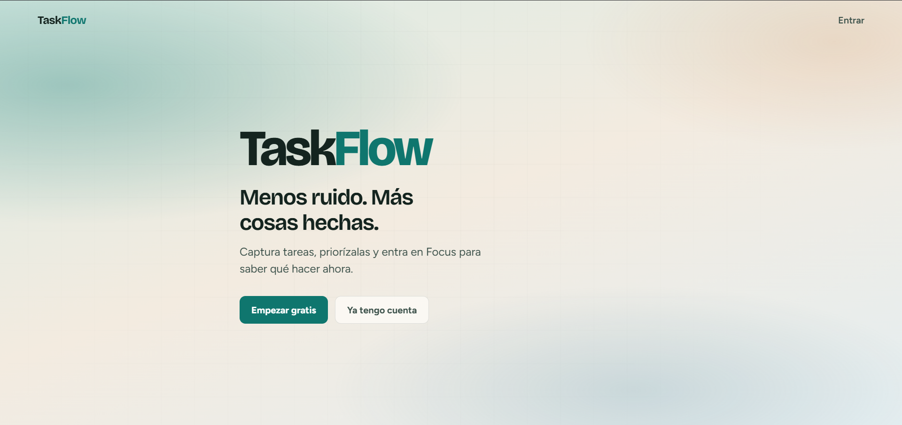
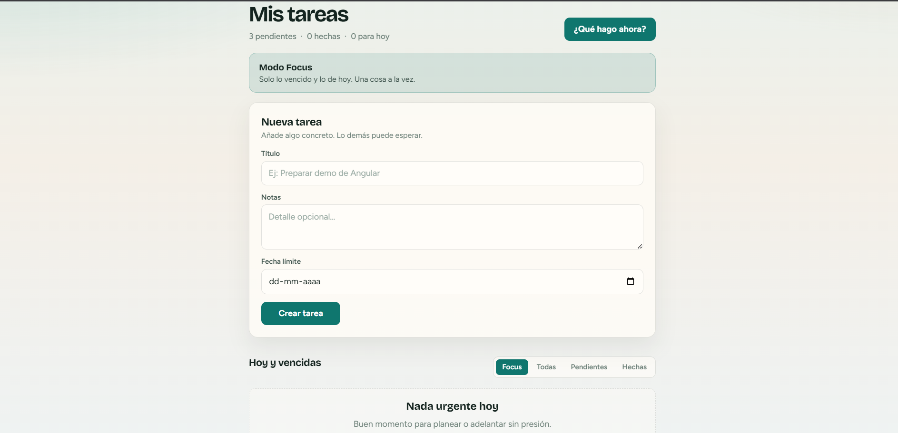
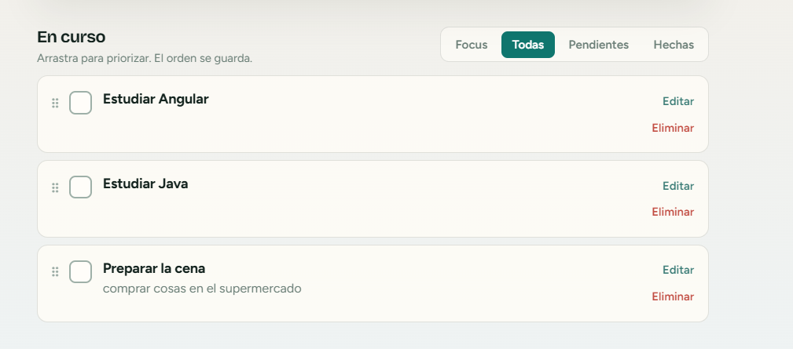

# TaskFlow

A focused task manager built with **Angular** and **Firebase**. Capture work, set due dates, prioritize with drag-and-drop, and answer one question clearly: **what should I do now?**

**Live demo:** [https://taskflow-878df.web.app](https://taskflow-878df.web.app)

---

## Problem

Most to-do apps turn into endless lists. You add tasks, mark a few done, and still lack a clear next action when time is limited.

## Solution

TaskFlow is built around urgency and priority:

- Due dates and completion state
- **Focus mode** — overdue + due today only
- Manual priority via **drag-and-drop** (persisted `order` in Firestore)
- Per-user auth with realtime sync

Less noise. More closure.

---

## Highlights

- **Focus / Today** — “What should I do now?” filters overdue and today’s tasks and highlights the next one.
- **Persisted reorder** — drag tasks in the All view; order is saved with a Firestore batch write.
- **Guards + Firestore Rules** — `authGuard` / `guestGuard` protect routes; security rules ensure users only read/write their own tasks.
- **Realtime updates** — the list stays in sync through `onSnapshot` after create, complete, edit, delete, or reorder.

---

## Screenshots

| Landing | Focus | Reorder |
|--------|--------|---------|
|  |  |  |

---

## Tech stack

| Layer | Technology |
|-------|------------|
| Frontend | Angular 22 (standalone components, lazy routes, signals) |
| Auth | Firebase Authentication (email / password) |
| Database | Cloud Firestore (realtime listeners, batch writes) |
| Hosting | Firebase Hosting |
| Styles | SCSS with shared design tokens |

---

## Getting started

### Prerequisites

- Node.js 20+
- npm
- A Firebase project with **Authentication** and **Firestore** enabled

### Run locally

```bash
npm install
cp src/environments/environment.example.ts src/environments/environment.ts
cp src/environments/environment.example.ts src/environments/environment.development.ts
npm start
```

Open [http://localhost:4200](http://localhost:4200).

Fill in your Firebase web config in those two files (they are gitignored). Security rules live in `firestore.rules`.

### Deploy

```bash
ng build
firebase deploy --only hosting

# security rules
firebase deploy --only firestore:rules
```

---

## Project structure

```
src/app/
  pages/          landing, login, dashboard
  components/     task-form, task-list
  services/       auth, task
  core/           firebase config, route guards
  models/         Task model + Focus helpers
```

---

## What this project demonstrates

- Modeling product UX in data (`order`, `dueDate`, Focus filtering)
- Angular route guards with Firebase auth state
- Client security paired with **Firestore Security Rules**
- Realtime UI with signals (no Zone.js / no manual `ChangeDetectorRef`)

---

## License

Portfolio project — free to explore and adapt.
